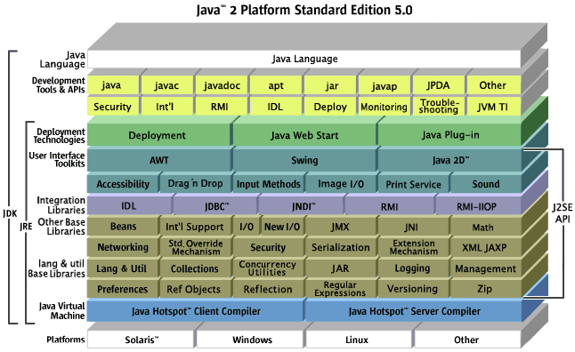
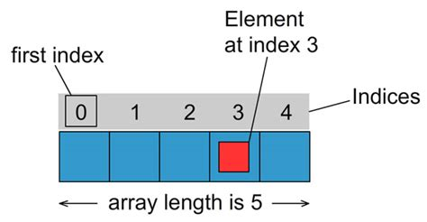

# Inhalte
> **Was ist dieses Dokument bzw. was ist es nicht?**  
> Dies ist eine Übersicht über die Inhalte, die im Seminar besprochen werden sollten. Der Sinn dieses Dokumentes ist es *nicht*, Erläuterungen zu allen Inhalten des Seminars bereitzustellen. Dies ist keine Lern-Ressource oder gar "Script" zum Seminar. Ziel ist vielmehr eine möglichst vollständige und semantisch bzw. didaktisch strukturierte Aufstellung aller Themen und Aspekte, ergänzt durch unterstützende Materialien (siehe Ordner `Materialien`), Links zu relevanten, weiterführenden Ressourcen (mit `#` gekennzeichnet), sowie passende Übungs- und Hausaufgaben aus diesem Repository (siehe Ordner `Hausaufgaben`).

- [Inhalte](#inhalte)
  - [Die Programmiersprache Java](#die-programmiersprache-java)
  - [Erste Schritte](#erste-schritte)
    - [Hello World! :rocket:](#hello-world-rocket)
    - [Pakete](#pakete)
    - [Java-Klassenbibliothek](#java-klassenbibliothek)
  - [Eclipse IDE](#eclipse-ide)
  - [Objektorientierte Programmierung (OOP)](#objektorientierte-programmierung-oop)
  - [Variablen](#variablen)
  - [Datentypen](#datentypen)
    - [Primitive Datentypen](#primitive-datentypen)
    - [Komplexe Datentypen](#komplexe-datentypen)
    - [Casting / Typumwandlung bei primitiven Datentypen](#casting--typumwandlung-bei-primitiven-datentypen)
  - [Methoden](#methoden)
  - [Operatoren](#operatoren)
    - [Arithmetische- / Rechenoperatoren](#arithmetische---rechenoperatoren)
  - [Post-/Preinkrement](#post-preinkrement)
    - [Vergleichsoperatoren](#vergleichsoperatoren)
    - [Boolsche / Logische Operatoren](#boolsche--logische-operatoren)
    - [Operatoren zur Bit-Manipulation (erstmal weglassen?)](#operatoren-zur-bit-manipulation-erstmal-weglassen)
    - [Zuweisungsoperatoren](#zuweisungsoperatoren)
  - [Strings / Zeichenketten](#strings--zeichenketten)
  - [Arrays](#arrays)
    - [Deklaration und Initialisierung](#deklaration-und-initialisierung)
    - [Zugriff und Manipulation](#zugriff-und-manipulation)
    - [Mehrdimensionale Arrays](#mehrdimensionale-arrays)
  - [Kontrollstrukturen](#kontrollstrukturen)
    - [if, else if, else](#if-else-if-else)
    - [Ternary-Operator](#ternary-operator)
    - [switch-case](#switch-case)
    - [Schleifen](#schleifen)
      - [for](#for)
      - [while](#while)
      - [do-while](#do-while)
  - [Fehlerbehandlung](#fehlerbehandlung)
  - [JavaDoc](#javadoc)
  - [OOP-Klassenkonzepte](#oop-klassenkonzepte)
    - [Konstruktoren](#konstruktoren)
    - [Sichtbarkeits-/Zugriffsmodifizierer](#sichtbarkeits-zugriffsmodifizierer)
    - [Getter & Setter](#getter--setter)
    - [Vererbung](#vererbung)
      - [Einfache Vererbung](#einfache-vererbung)
      - [Abstrakte Klassen](#abstrakte-klassen)
      - [Interfaces](#interfaces)
      - [Casting von komplexen Datentypen](#casting-von-komplexen-datentypen)


##  Die Programmiersprache Java
- C-artige, universelle Programmiersprache
- JVM [#](https://de.wikibooks.org/wiki/Java_Standard:_Java_Virtual_Machine)
- Bytecode
- Garbage Collector
- von Grund auf objektorientiert [#](https://de.wikibooks.org/wiki/Java_Standard:_Objektorientierung)
- sehr umfangreiche Standard-Library / Klassenbibliothek


Grafik: [#](Materialien/Java-Platform-Diagram.png)

## Erste Schritte

### Hello World! :rocket:
- Woraus besteht eine **Klasse** mindestens?
- Was ist eine **Methode**?
- **main**-Methode mit "Hello World!"
  - Einstiegspunkt ins Programm
  - Was ist ein String / Zeichenkette (Klasse/Objekt!)?

```java
public class HelloWorld {
      public static void main(String[] args) {
          System.out.println("Hello World!"); // ach, was!
      }
}
```

### Pakete
- Was sind Pakete und wozu sind sie da? [#](https://de.wikibooks.org/wiki/Java_Standard:_Erste_Schritte#Pakete)
- Wie sehen Pakete auf meiner Festplatte aus?
  
### Java-Klassenbibliothek
- Beispiele für häufig verwendete Klassen [#](https://de.wikibooks.org/wiki/Java_Standard:_Erste_Schritte#Klassenbibliothek)
- Paketstruktur der Klassenbibliothek

## Eclipse IDE
- Was ist das für ein Programm? [#](https://de.wikibooks.org/wiki/Java_Standard:_Einrichten_der_Programmierumgebung#Eclipse)
- Die wichtigsten Views (Package Manager, Editor, Outline, Console)
- Das erste Projekt anlegen
  - Was ist da alles drin?
  - Wo findet man das Paket-Konzept wieder?
- Import / Export von Projekten
- Programme ausführen über Kontextmenü und "Play"-Button

## Objektorientierte Programmierung (OOP)
- Was ist **OOP**? [#](https://de.wikibooks.org/wiki/Java_Standard:_Objektorientierung_Sinn_und_Zweck)
- Was ist eine **Klasse** (*konzeptuell, im Kontext d. OOP*)?
- Was ist ein **Objekt** (*konzeptuell, im Kontext d. OOP*)?

## Variablen
- sind Bezeichner für Werte in bestimmten Speicherbereichen, die mit der Variable angesprochen werden können
- Java ist streng typisiert, Deklaration daher immer unter Angabe des Datentyps
- naming conventions (lowerCamelCase)
- Gültigkeitsbereiche
  - Methode, Kontrollstruktur oder Klasse (**Klassenvariablen**!)

## Datentypen
### Primitive Datentypen
- `byte`, `short`, `int`, `long`, `float`, `double`, `boolean`, `char`
- Welche **default values** haben diese Datentypen?


Grafik: [#](Materialien/primitive-data-types.png), Quelle [#](https://de.wikibooks.org/wiki/Java_Standard)

### Komplexe Datentypen
- Klassen und Arrays sind komplexe Datentypen (dazu später mehr!)

### Casting / Typumwandlung bei primitiven Datentypen
- Implizite Typumwandlung: Ein "niederwertiger" Typ wird einem "höherwertigen" Typ zugewiesen (Umwandlung geschieht automatisch)
  - `double d; int i = 2; d = i;`


Grafik: [#](Materialien/typecast_1.jpg), Quelle: [#](https://www.java-tutorial.org/typecasting.html)

- Explizite Typumwandlung: Ein "höherwertiger" Typ wird in "niederwertigen" Typ umgewandelt
  - geschieht mittels cast-Operator
  - Ziel-Typ **muss** angegeben werden
  - `double d = 2.2d; int i; i = (int) d;`


Grafik: [#](Materialien/typecast_2.jpg), Quelle: [#](https://www.java-tutorial.org/typecasting.html)

## Methoden
- Rückgabetyp / `void`
- Parameter
- `return`
- naming: `lowerCamelCase()`
- Überlagerung von Methoden

## Operatoren
### Arithmetische- / Rechenoperatoren
- Einfache: ` + - * / % `
## Post-/Preinkrement
- Ausdruck und Operation mittels: `++` / `--`

```java
// Unterschied Post-/Preinkrement:
int i = 5;
int x = ++i; // i = 6 und x = 6 (hochzählen, dann zuweisen)

int i = 5;
int x = i++; // i = 6 und x = 5 (zuweisen, dann hochzählen)
```

### Vergleichsoperatoren
- Ergebnis von Vergleichsoperationen ist **immer** `true` oder `false`!
- `==`, `!=`, `>`, `<`, `>=`, `<=`

### Boolsche / Logische Operatoren
- `&&` und `||`
- Negation: `!` (invertiert einen Ausdruck)
- Exklusives ODER: `!=` (wenn nur 1 Operand `true` ist)

### Operatoren zur Bit-Manipulation (erstmal weglassen?)
- `~`, `&`, `|`, `^`
- `>>`, `>>>`, `<<`

### Zuweisungsoperatoren
- Einfache: `=`
- Arithmetische: `+=`, `-=`, `/=`, `*=`, `%=`
- Logische: `&=`, `|=`, ...

```java
// Logische Zuweisungsoperatoren
boolean t = true;
boolean f = false;
t &= f; // hiernach: t = false, weil nicht beide true
```

## Strings / Zeichenketten
- `String` ist eine Klasse in Java
- Ein `String` ist eine Zeichenkette, also eine Sequenz (intern: Array) von `char`-Werten
- Strings sind in Java **nicht veränderlich** (denn sie sind Arrays von `char`s)
- String-Literals erzeugen Strings ohne den `new`-Operator
  - werden mit `"doppelten Anführungszeichen"` gebildet
- Konkatenation/Verkettung von Strings mit `+`
- Spezial-Zeichen
  - `"\n"` (newline) und `"\t"` (tab)
  - `\` muss deshalb maskiert werden: `"\\"`
- Für viele/wiederholte Manipulationen: `StringBuffer`

## Arrays
- lineare Datenstruktur (Elemente haben klare Reihenfolge)
- Indizes von `0` bis `array.length - 1` (!)
- Arrays müssen typisiert werden, alle Typen (primitive und komplexe) möglich
- Arrays sind in Größe/Länge **unveränderlich**!
- Arrays **sind Objekte** und vom Typ `Object` (siehe [JLS Java SE 8 Edition](https://docs.oracle.com/javase/specs/jls/se8/html/jls-10.html))


Grafik: [#](Materialien/array.jpeg), Quelle [#](https://javatutorial.net/java-array)

### Deklaration und Initialisierung
- Deklaration mit `typ[] arrayName` bzw. `Typ[] arrayName`
- Initialisierung mit `new typ[n]` bzw. `new Typ[n]`, wobei `n` die Größe des Arrays angibt 

```java
// ein Array für 5 int-Werte
int[] numbers = int[5];
// ein Array für 5 String-Objekte
String[] worte = new String[5];
```

- Die initialien Werte eines leeren Arrays entsprechen den default-Werten des entsprechenden Datentyps

```java
int[] numbers = int[5]; // entspricht {0, 0, 0, 0, 0}
```

- Array Literals mit enthaltenen Werten: `{E1, E2, E2, E4, ..., En}`
  - Länge des Arrays implizit!

```java
int[] numbers = {3, 6, 345, 1, 0, 4}; // Länge: 6
String[] worte = {"Dies", "sind", "Strings!"}; // Länge: 3
```

### Zugriff und Manipulation
- Zugriff auf Elemente mit numerischem Index-Wert: `array[i]`
- Manipulation der Elemente mittels Zuweisung: `array[i] = 3`

```java
// ein Array für 3 int-Werte
int[] numbers = new int[2];
// Zugriff und Manipulation
numbers[0] = 45; // erstes Element
numbers[1] = 2; // zweites Element
numbers[3] = numbers[0]; // drittes Element
```

### Mehrdimensionale Arrays
- Arrays können (theoretisch) beliebig viele Dimensionen besitzen bzw. beliebig tief "verschachtelt" sein
- Jedes Array einer Unter-Ebene *kann* dabei eine andere Länge besitzen

```java
// zwei-dimensionales int-Array; entspricht einem
// Array aus vier int-Arrays der Länge 2
int[][] matrix = new int[4][2];
// Die Länge der Arrays in tieferen Dimensionen kann
// (vorerst) unbestimmt bleiben und sich letztendlich 
// unterscheiden
int[][] twoDimensions = new int[4][];
// auch hier sind Litarals möglich:
int[][] twoDimLiteral = {{2, 4}, {1, 54, 6}};
```

## Kontrollstrukturen
- steuern den Ablauf des Programms
- bilden eigene Gültigkeitsbereiche
### if, else if, else
- Ausführung von Code abhängig von Wahrheitswert einer Aussage / eines boolschen Ausdrucks
- Lässt sich gut übersetzen mit *"wenn", "dann", "sonst"* bzw. *"wenn", "dann", "sonst wenn", ..., "sonst"*
- besteht mindestens aus **einem** `if`-Block, einer **beliebigen Anzahl von** `else if`-Blöcken und **maximal einem** `else`-Block

```java
boolean t = true;
boolean f = false;

if (t && f){
  // beides wahr!
} else if (t || f) {
  // eins von beidem wahr
} else {
  // beides unwahr
}
```

### Ternary-Operator

### switch-case
### Schleifen
#### for
#### while
#### do-while

## Fehlerbehandlung
...

## JavaDoc
...

## OOP-Klassenkonzepte
Welche Konzepte stehen zum Aufbau von Klassen zur Verfügung?
### Konstruktoren
...
### Sichtbarkeits-/Zugriffsmodifizierer
- `private`
- `(default)`
- `protected`
- `public`
### Getter & Setter
### Vererbung
- Alle Klassen erben automatisch von `Object`
#### Einfache Vererbung
#### Abstrakte Klassen
#### Interfaces
#### Casting von komplexen Datentypen