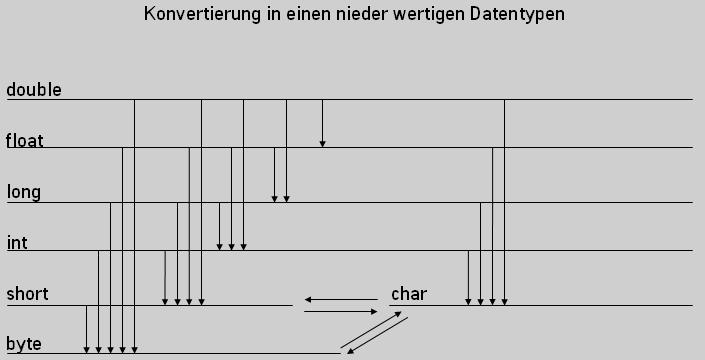

# Casting :performing_arts:

(auch: *Typumwandlung*)

## ... von primitiven Datentypen

-   Implizite Typumwandlung: Ein "niederwertiger" Typ wird einem "höherwertigen" Typ zugewiesen (Umwandlung geschieht automatisch)
    -   `double d; int i = 2; d = i;`

  
Grafik: [#](../assets/images/typecast_1.jpg), Quelle: [#](https://www.java-tutorial.org/typecasting.html)

-   Explizite Typumwandlung: Ein "höherwertiger" Typ wird in "niederwertigen" Typ umgewandelt
    -   geschieht mittels cast-Operator
    -   Ziel-Typ **muss** angegeben werden
    -   `double d = 2.2d; int i; i = (int) d;`

  
Grafik: [#](../assets/images/typecast_2.jpg), Quelle: [#](https://www.java-tutorial.org/typecasting.html)

## ... von komplexen Datentypen

**:warning: Achtung!** Der folgende Abschnitt ist erst relevant, wenn du bereits mit Vererbung und Klassenhierarchien vertraut bist!

-   möglich von Superklassen zu Subklassen (auf eigene Verantwortung)
-   unnötig von Subklassen zu Superklassen (wg. [Polymorphie](https://de.wikipedia.org/wiki/Polymorphie_(Programmierung)))
-   ...

<!-- Dieser Link sollte am Ende der Datei stehen! -->
<a class="top-link" href="#" title="Zum Anfang scrollen!">top:balloon:</a>